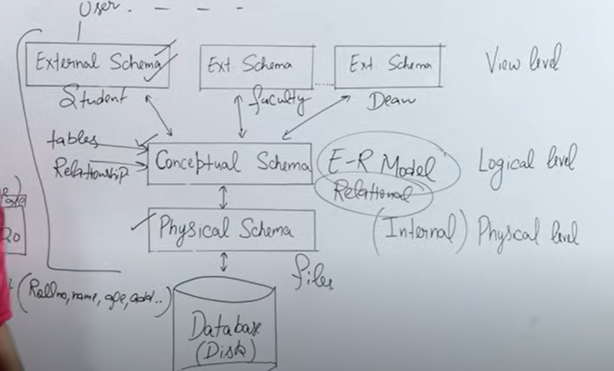

# DBMS Interview Questions

## Question 1:
Why do we need a Database Management System (DBMS)?

## Answer:
A **Database Management System (DBMS)** is essential for managing data effectively and securely in modern applications. Here's why:

1. **Efficient Data Management**:
   - DBMS provides a systematic way to organize, retrieve, and manage large volumes of data.
   - It eliminates redundancy through normalization and ensures data consistency.

2. **Data Security and Integrity**:
   - By enforcing constraints (like primary keys, foreign keys, and checks), DBMS ensures that only valid and accurate data is stored.
   - Advanced authentication and authorization mechanisms protect against unauthorized access.

3. **Concurrency and Transaction Management**:
   - DBMS supports simultaneous access by multiple users while maintaining data integrity through mechanisms like locking and transactions.

4. **Backup and Recovery**:
   - It offers built-in tools for automatic data backup and crash recovery, ensuring minimal downtime and no data loss.

5. **Query Optimization**:
   - DBMS uses optimization techniques to execute queries efficiently, reducing response time for complex operations.

6. **Data Independence**:
   - DBMS separates the logical data structure (schemas) from physical storage, making it easier to adapt to changes without affecting applications.

7. **Scalability and Performance**:
   - DBMS scales horizontally and vertically to handle increasing data loads while maintaining performance.

8. **Elimination of Manual Effort**:
   - It reduces manual effort by automating common data management tasks, such as indexing and querying.

---

## Key Takeaway:
A DBMS simplifies and automates complex data management tasks, making it critical for modern applications that require scalability, reliability, and performance while ensuring data security and consistency.

---

# File Management System vs Database Management System

## Question:
What is the difference between a File Management System (FMS) and a Database Management System (DBMS)?

## Answer:

### 1. Definition:
- **FMS**: Organizes and manages data in flat files.
- **DBMS**: Manages structured databases with advanced data handling capabilities.

### 2. Key Differences:

| Feature                | File Management System (FMS)             | Database Management System (DBMS)         |
|------------------------|------------------------------------------|-------------------------------------------|
| **Data Structure**     | Flat files                              | Structured (tables, rows, columns)        |
| **Redundancy**         | High                                    | Minimized using normalization             |
| **Data Integrity**     | Minimal checks                          | Enforced via constraints and rules        |
| **Concurrency**        | Limited support                         | Advanced mechanisms for multiple users    |
| **Backup and Recovery**| Manual                                  | Automated tools and mechanisms            |
| **Querying**           | Custom code required                    | SQL and other query languages supported   |
| **Scalability**        | Limited                                 | Scalable for large datasets and applications |
| **Cost**               | Low                                     | High (software and expertise required)    |

---

### Key Takeaway:
FMS is ideal for small, standalone systems, while DBMS is essential for complex, scalable, and secure applications.

---

# Three-Schema Architecture in DBMS

## Question:
What is the Three-Schema Architecture in DBMS? Explain the three levels of abstraction.

## Answer:

### 1. Internal Level (Physical Schema)
- **Definition**: Defines the physical storage structure of the database.
- **Purpose**: Optimizes storage and access methods for efficient data retrieval.
- **Key Elements**:
  - File structures
  - Indexing and hashing
  - Data compression techniques

---

### 2. Conceptual Level (Logical Schema)
- **Definition**: Represents the logical structure of the database.
- **Purpose**: Focuses on data organization and relationships, independent of physical storage.
- **Key Elements**:
  - Entities and relationships
  - Attributes and constraints
  - Normalized tables

---

### 3. External Level (User Views)
- **Definition**: Provides a personalized view of the database tailored to the user’s needs.
- **Purpose**: Simplifies data interaction by hiding unnecessary details.
- **Key Elements**:
  - Views or subsets of the database
  - User-specific data formats

---

### **Diagram**:

---

## Advantages:
1. **Data Independence**:
   - Logical data independence ensures changes in the conceptual schema do not affect external schemas.
   - Physical data independence ensures changes in storage do not affect the conceptual schema.
2. **Simplified Maintenance**:
   - Clear separation of concerns allows for easier modifications.
3. **User-Specific Views**:
   - Ensures data security and tailored usability.

## Key Takeaway:
The Three-Schema Architecture separates user interaction from database implementation, ensuring data independence and efficient management.

---

## References:
- **"Database System Concepts" by Silberschatz et al.**
- **"Fundamentals of Database Systems" by Elmasri & Navathe**
